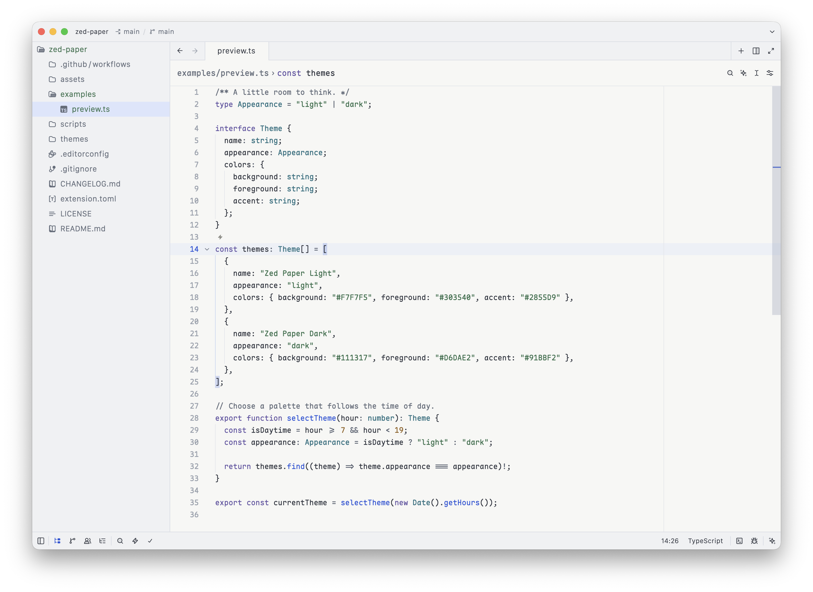
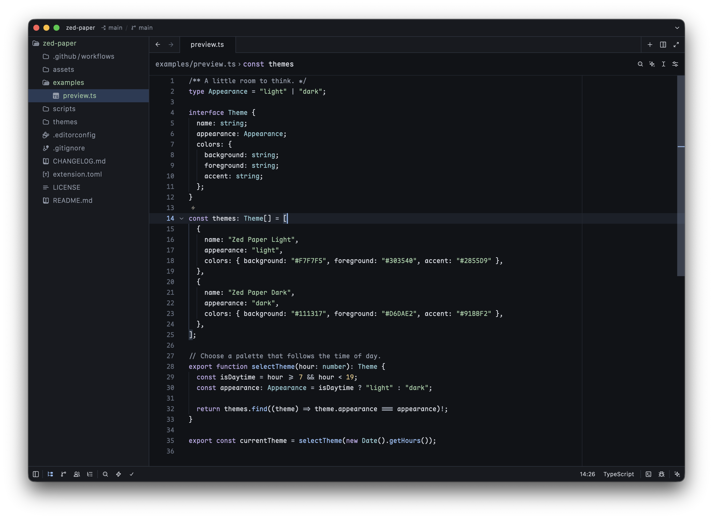

# Zed Paper

A quiet light and dark theme family for [Zed](https://zed.dev/), inspired by the colors of its website. Paper-white or charcoal surfaces, subtle borders, and blue accents, with restrained syntax colors for everyday coding.

- **Zed Paper Light** — soft paper, graphite text, and cobalt blue.
- **Zed Paper Dark** — near-black charcoal, cool gray text, and pale blue.
- Matching terminal colors, diagnostics, Git changes, selections, and collaboration cursors.

This is an independent project, not an official Zed theme. The colors are a visual interpretation of [zed.dev](https://zed.dev/), not extracted website assets.

## Screenshots

### Zed Paper Light



### Zed Paper Dark



## Install

Install this repository as a [dev extension](https://zed.dev/docs/extensions/developing-extensions#developing-an-extension-locally). It includes the extension manifest and both theme variants.

1. Clone [this repository](https://github.com/nmbrone/zed-paper):

   ```sh
   git clone https://github.com/nmbrone/zed-paper.git
   ```

2. In Zed's command palette, run `zed: install dev extension` (or click **Install Dev Extension** on the Extensions page).
3. Select the cloned `zed-paper` directory containing `extension.toml`.
4. Run `theme selector: toggle` and choose **Zed Paper Light** or **Zed Paper Dark**.

Keep the cloned directory in place while using the dev extension. Alternatively, you can copy `themes/zed-paper.json` into Zed's themes directory following [Zed's local theme instructions](https://zed.dev/docs/themes#local-themes).

To follow your system appearance, merge this into your Zed settings:

```json
{
  "theme": {
    "mode": "system",
    "light": "Zed Paper Light",
    "dark": "Zed Paper Dark"
  }
}
```

The theme is not yet listed in Zed's extension store.

## Development

Edit `themes/zed-paper.json`, then run this command with Python 3.9 or newer:

```sh
python3 scripts/validate.py
```

The validator checks structure, duplicate keys, hex colors, and syntax contrast. It is not a full upstream JSON Schema validator. GitHub Actions runs these checks and parses the extension manifest on pushes and pull requests.

For visual review, open representative source files and check both themes, selections, search results, diagnostics, and terminal output. Use the dev extension installation above to review this repository in Zed.

Changes are tracked in [CHANGELOG.md](CHANGELOG.md).

## License

[MIT](LICENSE) © 2026 Serhii Snozyk.
